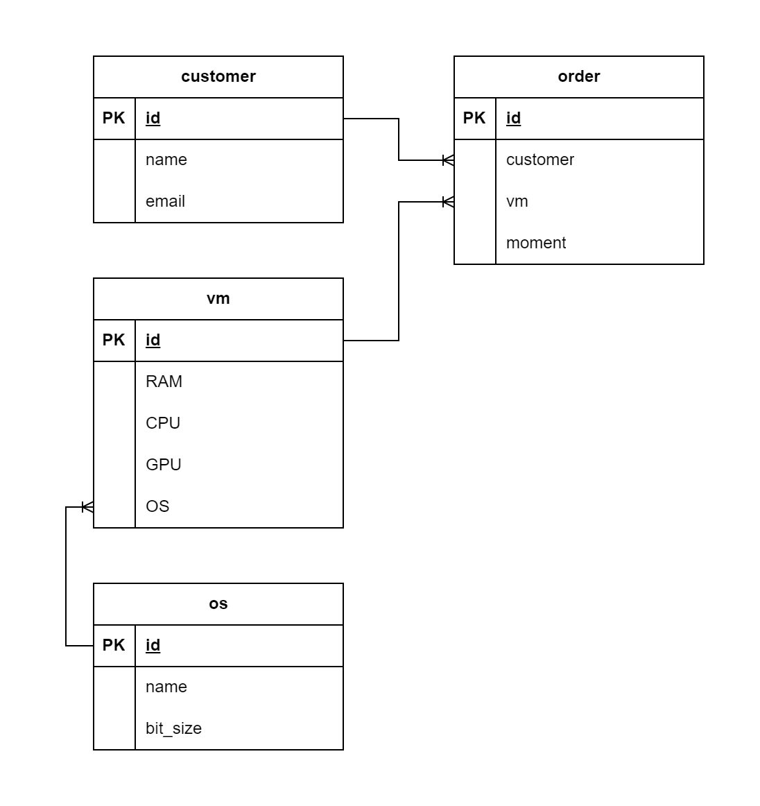

# Приложение для заказа ресурсов в облаке
Сделать архитектурные документы:
1) Разработать экранные формы интерфейса(UI/UX) в https://www.figma.com/, https://pixso.net/ru/ или https://app.diagrams.net/
2) Разработать полную ERD домена в https://www.dbdesigner.net/
3) Добавить в OPENAPI разработанный на семинаре одну команду ( DELETE) Код OPENAPI разработанный на семинаре приложен к материалам урока. Выгрузить сгенерированный swagger код на GitHub студента. https://editor.swagger.io/
## 1. UX/UI
Поскольку в ТЗ не идет речь о всех функциональных элементах сайта, а только о странице заказа ресурсов, делаю только ее.

## 2. ERD-диаграмма

## 3. OPENAPI
[Swagger Code](openapi.yaml)