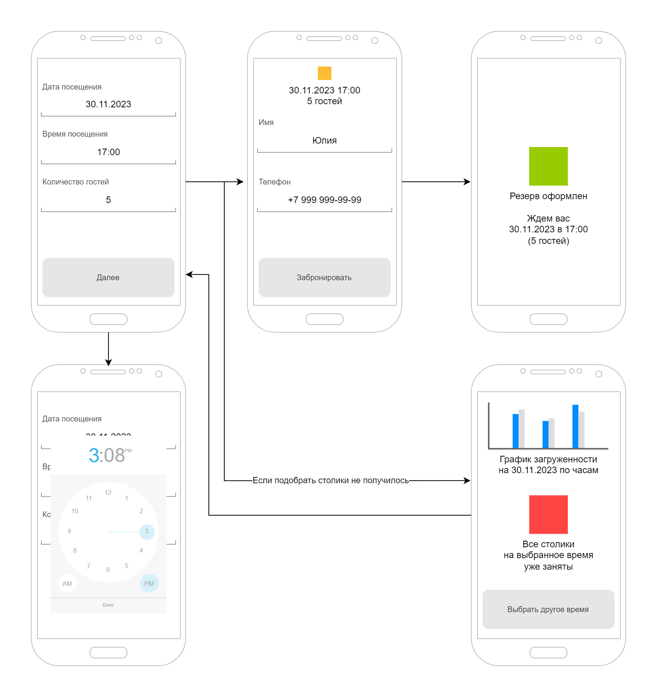
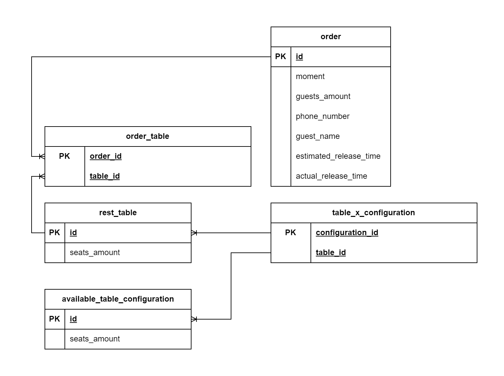
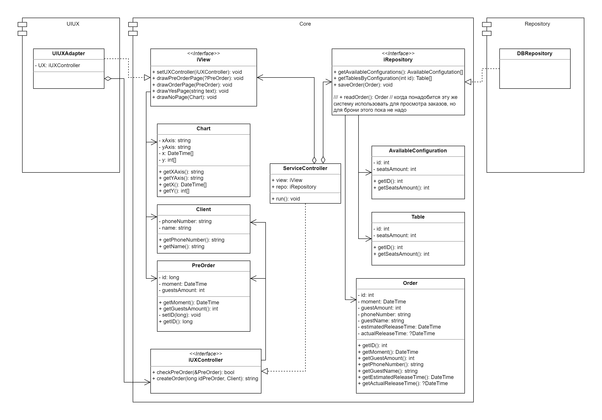

# Приложение для заказа столика в ресторане 
Сделать архитектурные документы:
1) Разработать экранные формы интерфейса(UI/UX) в https://www.figma.com/, https://pixso.net/ru/ или https://app.diagrams.net/
2) Разработать полную ERD домена в https://www.dbdesigner.net/
3) Разработать UML-диаграмму классов
## 1. UX/UI

## 2. ERD-диаграмма

## 3. UML-диаграмма
