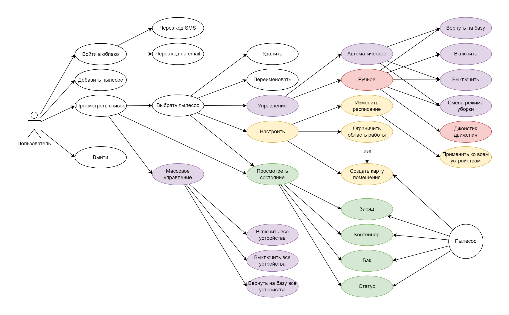
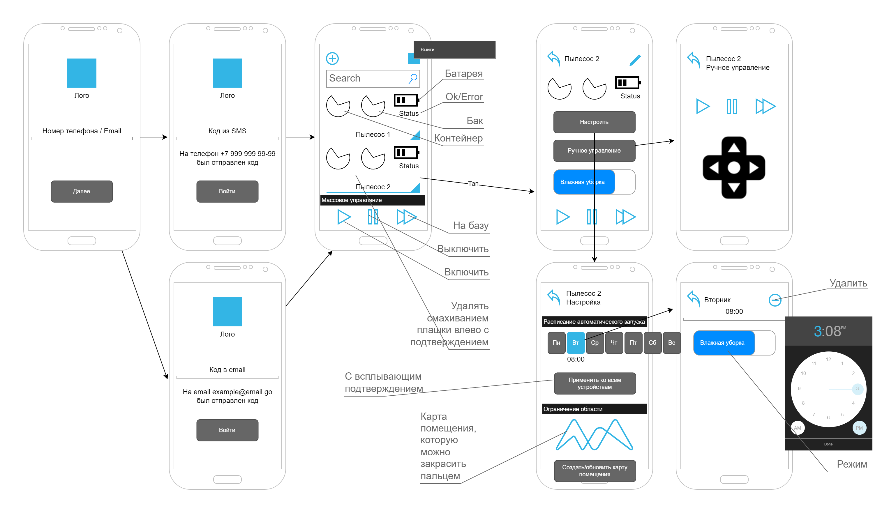
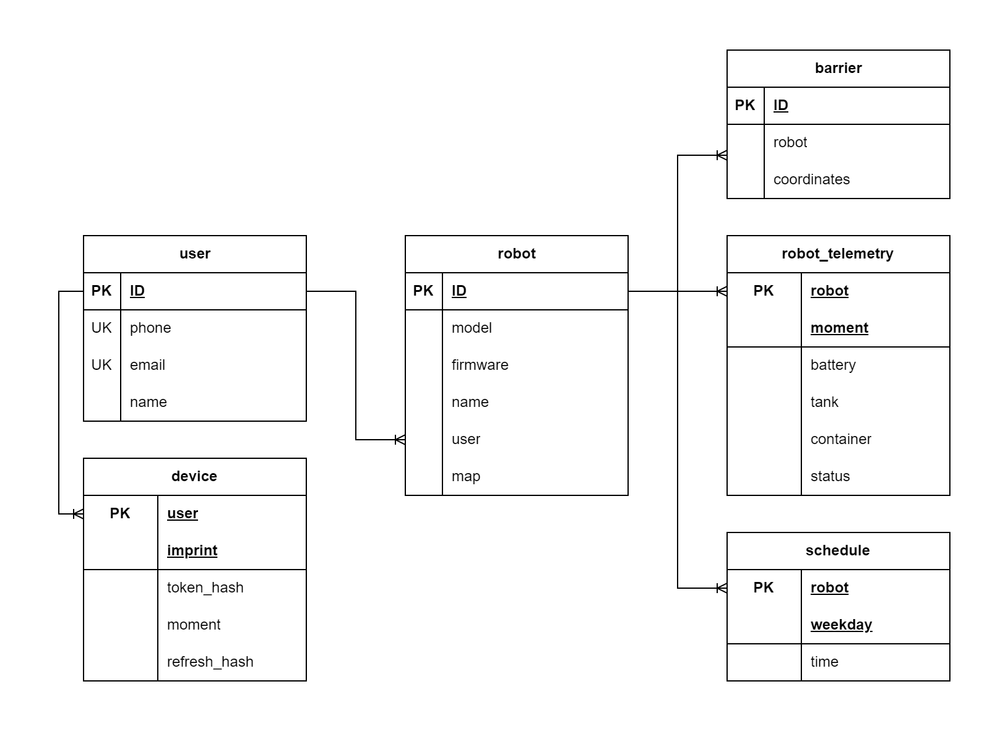
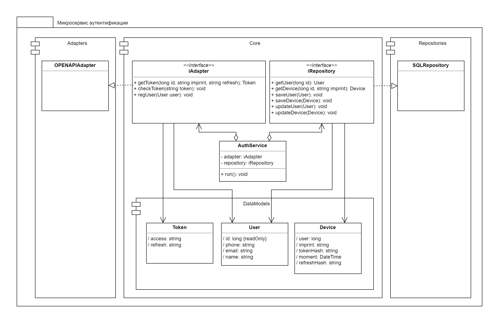

# Приложение для управления робот-пылесосом
Сделать архитектурные документы:
1) UseCase-диаграмму
2) UI/UX мобильного приложения
3) ERD-диаграмму данных хранимых в облаке
4) OPENAPI команды PUT, GET, DELETE, POST для сущностей User, Group, Robot, Shedule
5) UML-диаграмму микросервиса аутентификации на основе токенов безопасности

Инструменты:
1. https://www.figma.com/
2. https://app.diagrams.net/
3. https://online.visual-paradigm.com/
## 1. UseCase-диаграмма

## 2. UX/UI

## 3. ERD-диаграмма данных хранимых в облаке

## 4. OPENAPI
[Swagger Code](openapi.yaml)
## 5. UML-диаграмма микросервиса аутентификации на основе токенов безопасности
