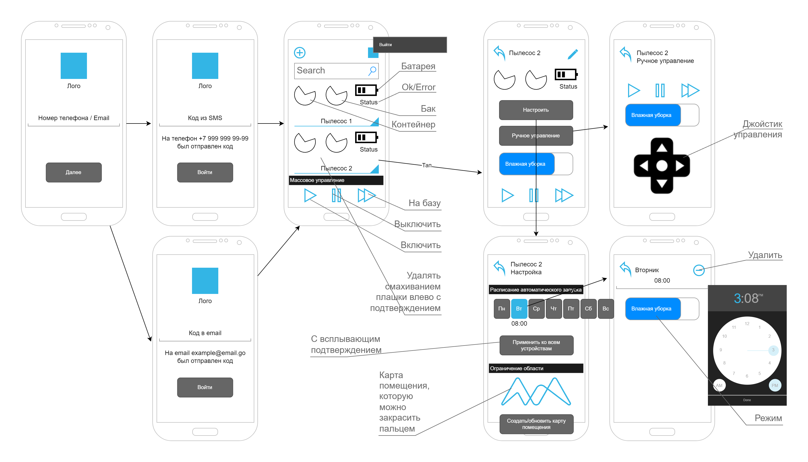

# Приложение для управления робот-пылесосом
Сделать архитектурные документы:
1) UseCase-диаграмму
2) UI/UX мобильного приложения

Инструменты:
1. https://www.figma.com/
2. https://app.diagrams.net/
3. https://online.visual-paradigm.com/
## 1. UseCase-диаграмма

## 2. UX/UI
